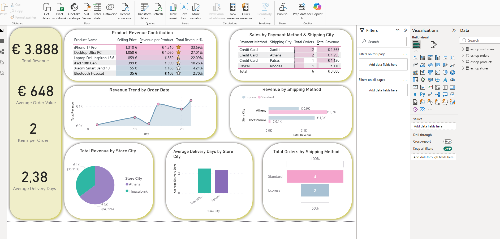

# 🛒 E-Commerce Analytics with MongoDB & Power BI

This repository demonstrates a complete data pipeline: from schema design in **MongoDB** to interactive visualization and KPI tracking in **Power BI**.

## 📌 Project Overview
The goal of this project is to simulate a modern e-commerce environment and extract **business insights** related to sales performance, customer behavior, and logistics efficiency.

## 📈 Dashboard Preview


## 🔄 Data Pipeline
1. **Generation:** Data generated via custom MongoDB scripts in VS Code.
2. **Database:** Data hosted on **MongoDB Atlas** and managed via **Compass**.
3. **Extraction:** Exported to flat files (CSV) for BI compatibility.
4. **ETL:** Data cleaned and transformed using **Power Query**.
5. **Modeling:** Developed a star-schema inspired model with **DAX** measures.
6. **Deployment:** Version control and portfolio presentation via **GitHub**.

## 🗄️ Database Design (MongoDB)
The database utilizes a document-oriented approach with the following collections:
* [01_use_db.js](./scripts-mongodb/01_use_db.js): Create database.
* [02_stores.js](./scripts-mongodb/02_stores.js): Metadata for physical store locations and cities.
* [03_products.js](./scripts-mongodb/03_products.js): Catalog featuring pricing and categories.
* [04_customers.js](./scripts-mongodb/04_customers.js): Customer demographic information.
* [05_orders.js](./scripts-mongodb/05_orders.js): Transactional data with nested items (embedded product details, quantities, and prices).


## 📊 Business Intelligence & KPIs

### 🔑 Key Performance Indicators (KPIs)
* **Total Revenue**: The cumulative value of all successful transactions.
* **Average Order Value (AOV)**: Revenue generated per unique order.
* **Items per Order**: Average basket size.
* **Avg Delivery Time**: Efficiency of the logistics pipeline in days.

### 📈 Visualizations
- Revenue Trend by Order Date (Line Chart)
- Product Revenue Contribution (% of total)
- Revenue by Store City
- Revenue by Shipping Method
- Orders by Shipping Method (100%)
- Average Delivery Days by Store City
- Sales by Payment Method & Shipping City


### 🧮 Sample DAX Measures
```dax
Total Revenue = SUM(Orders[Selling Price])

Total Orders = DISTINCTCOUNT(Orders[order_number])

Average Order Value = DIVIDE([Total Revenue], [Total Orders])

Items per Order = DIVIDE(SUM(Orders[Product Qty]), [Total Orders])
```

### 🛍️ Product & Sales Performance
High-Value Contribution: The iPhone 17 Pro is the flagship performer, contributing ~34% of total revenue despite lower sales volume compared to accessories.

Store Rankings: The Athens store is the primary revenue driver, accounting for 65% of total sales, significantly outperforming regional branches.

### 🚚 Logistics & Payments
Shipping Trends: While Standard shipping is the volume leader, Express shipping is correlated with higher-value orders.

Payment Preferences: Credit Cards remain the dominant payment method, suggesting a customer base with high digital payment adoption.

### 📦 Order Behavior
Customers purchase an average of **2 items per order**.


### 📥 How to Run
Navigate to /mongodb-scripts/.

Run the scripts in numbered order (01 to 05) in your MongoDB environment.

Open the .pbix file in /powerbi-report-eshop/ to explore the interactive report.

## Author
### Georgios Konstantopoulos
